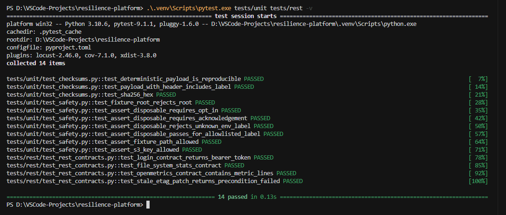

# Resilience Platform — Qumulo Test Examples

Professional-grade example tests for the Qumulo Core REST control plane (Locust + pytest), S3, NFS, SMB, and cross-protocol namespace consistency. Offline contract tests run by default; live integration tests require explicit opt-in against a **disposable** cluster.

Based on the official [Qumulo API introduction](https://github.com/Qumulo/qumulo-api-introduction).

## Quick start

```powershell
cd d:\VSCode-Projects\resilience-platform
python -m venv .venv

# Option A (recommended): allow local scripts for your user account only
Set-ExecutionPolicy -ExecutionPolicy RemoteSigned -Scope CurrentUser
.\.venv\Scripts\Activate.ps1

# Option B: activate for this PowerShell window only (no permanent policy change)
Set-ExecutionPolicy -ExecutionPolicy Bypass -Scope Process
.\.venv\Scripts\Activate.ps1

# Option C: skip activation and call the venv directly
.\.venv\Scripts\python.exe -m pip install -e ".[dev]"

# Offline tests (default — no cluster required)
.\.venv\Scripts\pytest.exe tests/unit tests/rest -v

# Lint and type check
.\.venv\Scripts\ruff.exe check src tests
.\.venv\Scripts\mypy.exe src
```

If `Activate.ps1` is blocked, you can also use **Command Prompt** instead of PowerShell:

```cmd
.venv\Scripts\activate.bat
```

Example offline run (14 unit + REST contract tests):



## Install Qumulo SDK

The project depends on `qumulo-api` (includes the `qq` CLI). Pin to your cluster Core version when needed:

```powershell
pip install "qumulo-api==7.9.2.1"
```

Verify connectivity:

```powershell
$env:API_HOSTNAME = "your-cluster"
$env:API_USER = "admin"
$env:API_PASSWORD = "***"
qq --host $env:API_HOSTNAME login -u $env:API_USER -p $env:API_PASSWORD
qq --host $env:API_HOSTNAME fs_get_stats
```

## Safety gates (live tests)

Live/destructive tests **refuse to run** unless all of the following are set:

| Variable | Purpose |
|----------|---------|
| `RESILIENCE_ENABLE_LIVE_TESTS=true` | Explicit opt-in |
| `RESILIENCE_ACK_DISPOSABLE_TARGET=true` | Confirm target is disposable |
| `RESILIENCE_ENV_LABEL` | Must be in `RESILIENCE_ALLOWED_ENV_LABELS` (default: `disposable-vm,sandbox,lab-vm`) |
| `RESILIENCE_FIXTURE_ROOT` | Must start with `/resilience` (default: `/resilience-fixtures`) |

Copy [`.env.example`](.env.example) to `.env` and fill in cluster credentials locally (never commit).

Preflight check:

```powershell
pip install -e .
resilience-preflight
```

## Test layout

| Directory | Tests | Default run |
|-----------|-------|-------------|
| `tests/unit/` | Settings, safety, checksums | Always |
| `tests/rest/` | Mocked REST contracts | Always |
| `tests/rest/locust/` | 3 Locust scenarios | Live / load |
| `tests/s3/` | PUT/HEAD/GET, multipart, listing | Live (skipped offline) |
| `tests/nfs/` | Integrity, rename, advisory locks | Live (skipped offline) |
| `tests/smb/` | Round-trip, locks, reopen | Live (skipped offline) |
| `tests/cross_protocol/` | S3↔NFS, NFS↔SMB, SMB↔S3/NFS, REST↔NFS | Live (skipped offline) |

## Locust scenarios

Three scenarios in [`tests/rest/locust/locustfile.py`](tests/rest/locust/locustfile.py), selected via `LOCUST_SCENARIO`:

| Scenario | Behavior | Invariant |
|----------|----------|-----------|
| `health_read` | Filesystem stats + cluster version | Schema-valid JSON, no 5xx |
| `openmetrics` | OpenMetrics polling | Non-empty metrics payload |
| `etag_conflict` | Range read + stale ETag PATCH | Stale write returns 412, not silent overwrite |

```powershell
$env:LOCUST_SCENARIO = "health_read"
$env:QUMULO_USER = "admin"
$env:QUMULO_PASSWORD = "***"
locust -f tests/rest/locust/locustfile.py `
  --host https://your-cluster:8000 `
  --headless -u 10 -r 2 -t 60s `
  --csv evidence/locust-health
```

## Docker profiles

```powershell
# Offline unit + REST contract tests
docker compose run --rm test-offline

# Live REST + S3 (configure .env first)
docker compose run --rm test-live-rest-s3

# Live NFS/SMB/cross-protocol (privileged mounts)
docker compose run --rm test-live-protocols

# Locust health scenario
docker compose run --rm locust-health
```

The `protocols` image profile mounts NFS (`QUMULO_NFS_EXPORT`) and SMB (`QUMULO_SMB_SERVER`/`QUMULO_SMB_SHARE`) via [`scripts/mount_protocols.sh`](scripts/mount_protocols.sh) with signal-safe unmount on exit.

## Running live pytest

```powershell
$env:RESILIENCE_ENABLE_LIVE_TESTS = "true"
$env:RESILIENCE_ACK_DISPOSABLE_TARGET = "true"
$env:RESILIENCE_ENV_LABEL = "disposable-vm"
pytest tests/s3 tests/nfs tests/smb tests/cross_protocol -m live -v
```

## Expected offline behavior

- **Unit + REST contract tests**: run and pass without a cluster.
- **Live protocol tests**: collected but skipped with reason (safety gate or missing mount/credentials).
- **Locust**: requires `--host` and credentials; use headless mode for CI/load lanes.

## Troubleshooting

| Issue | Fix |
|-------|-----|
| PowerShell `Activate.ps1` blocked | Run `Set-ExecutionPolicy RemoteSigned -Scope CurrentUser`, or use `Bypass -Scope Process`, or call `.\.venv\Scripts\python.exe` directly |
| SDK/API version mismatch | `pip install qumulo-api==<Core version>` |
| NFS/SMB skips in container | Use `test-live-protocols` profile with `SYS_ADMIN` and valid export/share |
| Locust login failures | Verify `QUMULO_USER`/`QUMULO_PASSWORD` and REST port 8000 |
| Writes rejected | Confirm `RESILIENCE_FIXTURE_ROOT` and run ID prefix |

## Evidence

Failed cross-protocol runs write JSON artifacts under `evidence/<run_id>/`. Locust CSV output can be directed with `--csv evidence/<name>`.
